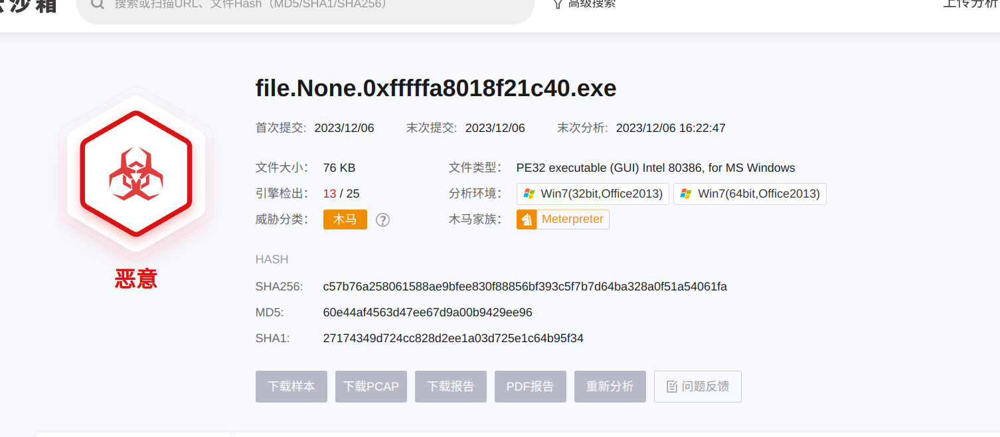

# mem内存取证题

先看题目

```
A集团某电脑系统被恶意份子攻击并控制，怀疑其执行了破坏操作，窃取了集团内部的敏感信息，现请分析A集团提供的系统镜像和内存镜像，找到系统镜像中的恶意软件，分析恶意软件行为。
```

| 序号 | 任务内容                                            | 答案 | 参考分值 |
| ---- | --------------------------------------------------- | ---- | -------- |
| 1    | 请提交用户桌面下的压缩包密码                        |      | 1        |
| 2    | 请提交解密后的flag（格式为：flag{...}）             |      | 2        |
| 3    | 请提交用户后台运行的恶意进程名                      |      | 1        |
| 4    | 请提交恶意进程反向连接的IP和端口（格式为：ip:port） |      | 2        |

老一套，先用imageinfo查看是什么机器

```shell
[neko@NekoArch 题目]$ vol.py -f mem.vmem imageinfo
Volatility Foundation Volatility Framework 2.6
INFO    : volatility.debug    : Determining profile based on KDBG search...
          Suggested Profile(s) : Win7SP1x64, Win7SP0x64, Win2008R2SP0x64, Win2008R2SP1x64_23418, Win2008R2SP1x64, Win7SP1x64_23418
                     AS Layer1 : WindowsAMD64PagedMemory (Kernel AS)
                     AS Layer2 : FileAddressSpace (/home/neko/Desktop/5.内存取证/题目/mem.vmem)
                      PAE type : No PAE
                           DTB : 0x187000L
                          KDBG : 0xf8000403a0a0L
          Number of Processors : 1
     Image Type (Service Pack) : 1
                KPCR for CPU 0 : 0xfffff8000403bd00L
             KUSER_SHARED_DATA : 0xfffff78000000000L
           Image date and time : 2023-03-28 11:46:47 UTC+0000
     Image local date and time : 2023-03-28 19:46:47 +0800
```

是windows7，也就是profile=Win7SP1x64，我们先来找恶意进程，他这里说恶意程序做了反向连接，那么第一个想到的就是通过netscan来查看网络连接

```shell
[neko@NekoArch 题目]$ vol.py -f mem.vmem --profile=Win7SP1x64 netscan
Volatility Foundation Volatility Framework 2.6
Offset(P)          Proto    Local Address                  Foreign Address      State            Pid      Owner          Created
0x7d63cec0         UDPv4    127.0.0.1:59858                *:*                                   1832     iexplore.exe   2023-03-28 11:44:51 UTC+0000
0x7d8fa6b0         UDPv4    172.16.54.141:137              *:*                                   4        System         2023-03-28 11:44:39 UTC+0000
0x7d93f010         UDPv4    172.16.54.141:138              *:*                                   4        System         2023-03-28 11:44:39 UTC+0000
0x7d9ddcb0         UDPv6    fe80::a402:164e:7f60:60a5:546  *:*                                   680      svchost.exe    2023-03-28 11:44:46 UTC+0000
0x7d8182d0         TCPv4    0.0.0.0:445                    0.0.0.0:0            LISTENING        4        System   
0x7d8182d0         TCPv6    :::445                         :::0                 LISTENING        4        System   
0x7d9d6480         TCPv4    -:0                            72.118.242.26:0      CLOSED           1832     iexplore.exe   
0x7d9d7430         TCPv6    -:0                            4876:f21a:80fa:ffff:4876:f21a:80fa:ffff:0 CLOSED           1832     iexplore.exe   
0x7d9d9340         TCPv4    -:0                            72.118.242.26:0      CLOSED           1832     iexplore.exe   
0x7db56c10         UDPv4    0.0.0.0:5355                   *:*                                   292      svchost.exe    2023-03-28 11:44:43 UTC+0000
0x7dc0fec0         UDPv4    0.0.0.0:0                      *:*                                   292      svchost.exe    2023-03-28 11:44:39 UTC+0000
0x7dc0fec0         UDPv6    :::0                           *:*                                   292      svchost.exe    2023-03-28 11:44:39 UTC+0000
0x7dcba3f0         UDPv4    0.0.0.0:5355                   *:*                                   292      svchost.exe    2023-03-28 11:44:43 UTC+0000
0x7dcba3f0         UDPv6    :::5355                        *:*                                   292      svchost.exe    2023-03-28 11:44:43 UTC+0000
0x7dce5ec0         UDPv4    0.0.0.0:68                     *:*                                   680      svchost.exe    2023-03-28 11:46:18 UTC+0000
0x7da33af0         TCPv4    0.0.0.0:49155                  0.0.0.0:0            LISTENING        440      services.exe   
0x7da33af0         TCPv6    :::49155                       :::0                 LISTENING        440      services.exe   
0x7da3cad0         TCPv4    0.0.0.0:49155                  0.0.0.0:0            LISTENING        440      services.exe   
0x7dc2f010         TCPv4    0.0.0.0:135                    0.0.0.0:0            LISTENING        628      svchost.exe  
0x7dcad230         TCPv4    0.0.0.0:49152                  0.0.0.0:0            LISTENING        348      wininit.exe  
0x7dcafda0         TCPv4    0.0.0.0:49152                  0.0.0.0:0            LISTENING        348      wininit.exe  
0x7dcafda0         TCPv6    :::49152                       :::0                 LISTENING        348      wininit.exe  
0x7dcba550         TCPv4    0.0.0.0:49156                  0.0.0.0:0            LISTENING        448      lsass.exe  
0x7dce3010         TCPv4    0.0.0.0:49153                  0.0.0.0:0            LISTENING        680      svchost.exe  
0x7dce36e0         TCPv4    0.0.0.0:49153                  0.0.0.0:0            LISTENING        680      svchost.exe  
0x7dce36e0         TCPv6    :::49153                       :::0                 LISTENING        680      svchost.exe  
0x7de33780         TCPv4    172.16.54.141:139              0.0.0.0:0            LISTENING        4        System   
0x7deb74f0         TCPv4    0.0.0.0:49156                  0.0.0.0:0            LISTENING        448      lsass.exe  
0x7deb74f0         TCPv6    :::49156                       :::0                 LISTENING        448      lsass.exe  
0x7df4f3a0         TCPv4    0.0.0.0:135                    0.0.0.0:0            LISTENING        628      svchost.exe  
0x7df4f3a0         TCPv6    :::135                         :::0                 LISTENING        628      svchost.exe  
0x7e645b60         TCPv4    0.0.0.0:49154                  0.0.0.0:0            LISTENING        848      svchost.exe  
0x7e756760         TCPv4    0.0.0.0:49154                  0.0.0.0:0            LISTENING        848      svchost.exe  
0x7e756760         TCPv6    :::49154                       :::0                 LISTENING        848      svchost.exe  
0x7fa0b300         UDPv4    0.0.0.0:55098                  *:*                                   292      svchost.exe    2023-03-28 11:46:46 UTC+0000
0x7fca7c80         UDPv6    ::1:1900                       *:*                                   2740     svchost.exe    2023-03-28 11:46:35 UTC+0000
0x7fcafc60         UDPv4    127.0.0.1:1900                 *:*                                   2740     svchost.exe    2023-03-28 11:46:35 UTC+0000
0x7fcb5cb0         UDPv4    172.16.54.141:1900             *:*                                   2740     svchost.exe    2023-03-28 11:46:35 UTC+0000
0x7fcb7890         UDPv6    ::1:56626                      *:*                                   2740     svchost.exe    2023-03-28 11:46:35 UTC+0000
0x7fcb9010         UDPv4    127.0.0.1:56627                *:*                                   2740     svchost.exe    2023-03-28 11:46:35 UTC+0000
0x7fcbbd40         UDPv6    fe80::a402:164e:7f60:60a5:1900 *:*                                   2740     svchost.exe    2023-03-28 11:46:35 UTC+0000
0x7fa7e010         TCPv4    172.16.54.141:49164            172.16.54.130:8443   ESTABLISHED      1232     SecurityHealth 

```

可以看到这里通向外部的网络的应用只有两个，一个ie和一个叫做SecurityHealth的进程，这里基本可以破案了

但是严谨期间，我们也可以找到他的执行文件来跑个沙箱

```shell
[neko@NekoArch 题目]$ vol.py -f mem.vmem --profile=Win7SP1x64 filescan | grep SecurityHealth
Volatility Foundation Volatility Framework 2.6
0x000000007fdc4900     16      0 R--rwd \Device\HarddiskVolume1\Windows\System32\SecurityHealthService.exe
0x000000007fdd8f20      9      0 R--r-d \Device\HarddiskVolume1\Windows\System32\SecurityHealthService.exe
0x000000007fdfa780     15      0 R--r-d \Device\HarddiskVolume1\Windows\System32\SecurityHealthService.exe
```

dumpfiles导出

```
[neko@NekoArch 题目]$ vol.py -f mem.vmem --profile=Win7SP1x64 dumpfiles -Q 0x000000007fdfa780 -D ./
Volatility Foundation Volatility Framework 2.6
ImageSectionObject 0x7fdfa780   None   \Device\HarddiskVolume1\Windows\System32\SecurityHealthService.exe
DataSectionObject 0x7fdfa780   None   \Device\HarddiskVolume1\Windows\System32\SecurityHealthService.exe
```



进程名：SecurityHealth

反连ip端口：172.16.54.130:8443

三分到手

接下来找zip文件，直接filescan

```
[neko@NekoArch 题目]$ vol.py -f mem.vmem --profile=Win7SP1x64 filescan | grep .zip
Volatility Foundation Volatility Framework 2.6
0x000000007d86af20     16      0 RW---- \Device\HarddiskVolume1\Users\user\Desktop\1.zip
0x000000007d93b070     16      0 R--r-- \Device\HarddiskVolume1\Windows\SysWOW64\zipfldr.dll
0x000000007dc9ce20      5      0 R--r-d \Device\HarddiskVolume1\Windows\SysWOW64\zipfldr.dll
0x000000007f0d7660     16      0 RW-rwd \Device\HarddiskVolume1\Users\user\Desktop\1.zip
0x000000007f133ef0     15      0 R--r-d \Device\HarddiskVolume1\Windows\System32\zipfldr.dll
```

找到了

```
[neko@NekoArch 题目]$ vol.py -f mem.vmem --profile=Win7SP1x64 dumpfiles -Q 0x000000007d86af20 -D ./
Volatility Foundation Volatility Framework 2.6
DataSectionObject 0x7d86af20   None   \Device\HarddiskVolume1\Users\user\Desktop\1.zip
```

dump

后面找来一圈密码，包括mimikatz也么找到，最后翻答案找到了，在剪切板里面。。。。

clipboard，这个命令可以用来输出命令行内容

```
[neko@NekoArch 题目]$ vol.py -f mem.vmem --profile=Win7SP1x64 clipboard
Volatility Foundation Volatility Framework 2.6
Session    WindowStation Format                         Handle Object             Data                                      
---------- ------------- ------------------ ------------------ ------------------ --------------------------------------------------
         1 WinSta0       CF_UNICODETEXT                0x60115 0xfffff900c2049360 vUucUP9Ic4                                
         1 WinSta0       CF_TEXT                          0x10 ------------------                                           
         1 WinSta0       0x100071L              0x200000000000 ------------------                                           
         1 WinSta0       CF_TEXT                           0x1 ------------------                                           
         1 ------------- ------------------           0x100071 0xfffff900c1c5a260                                             
```

```
[neko@NekoArch 题目]$ unzip 1.zip 
Archive:  1.zip
[1.zip] 机密资料.docx password: 
  inflating: 机密资料.docx   
```
