# 单机取证--磁盘取证

在我看来他的本质就是隐写大杂烩，从图片到office，从文本的base64到莫斯电码，无所不用其极，取证题绝对能拉开大部分队伍的分数（

## disk001.E01取证

这是集训的时候发的题目，看看解析罢

因为验尸狗"autopsy"对wine的适配并不好，所以不得已采用了vbox做windows虚拟机来运行

题目要我们找的信息是Evidence开头加上数字，那么我们可以直接使用工具里面的搜索功能来查询相关文本

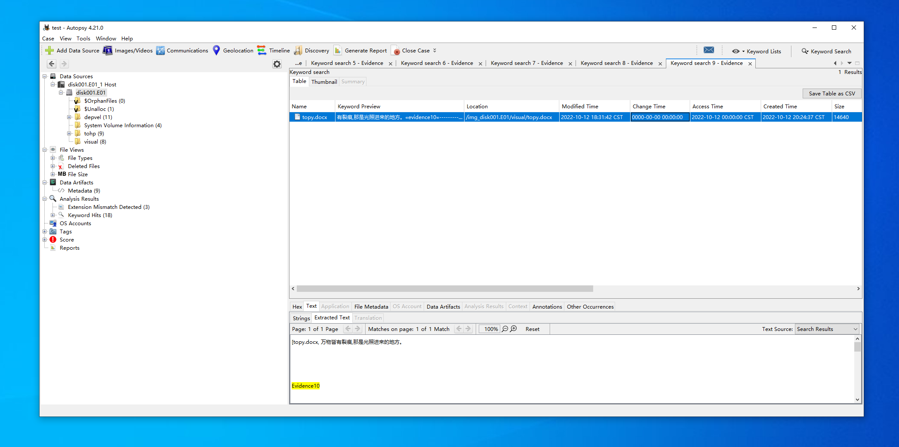

文件名：topy.docx

md5：04b87697a5fd9e168ced165d21d177e3

可以看到找到一个文件，evidence10，一分就到手了

接下来回到文件目录，可以简单翻一下，看看有没有什么明显的文件

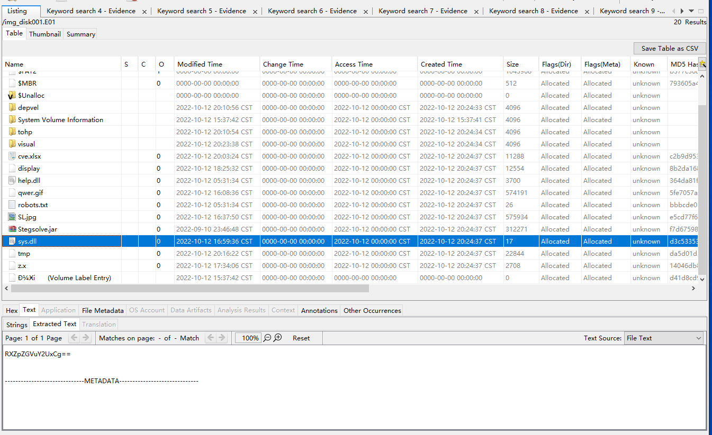

这个就是个非常明显的base64编码的字符串，可以把他做一下base64解码

`echo RXZpZGVuY2UxCg== | base64 -d`

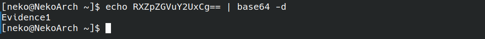

文件名：sys.dll

md5：d3c5335367e17b966a13e2663235a1ff

解码可得为evidence1，抄录他的md5即可

得到这两个相对简单的后，我卡了好久，借此说一下各位可以使用旁边工具栏的file  types，他会列出当前已知所以文件类型，有时候用它查找会方便很多

然后翻答案看到了这个

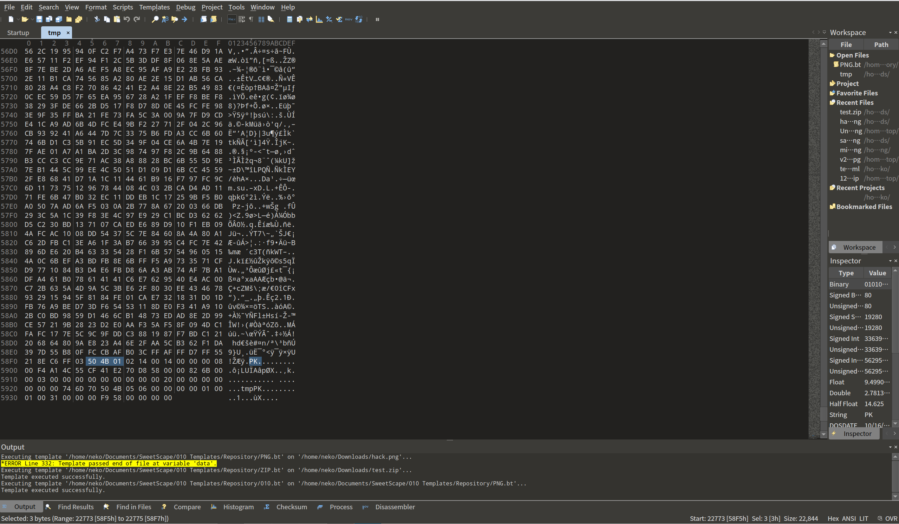

这个是根目录下的一个叫做tmp的文件，这就比较坑人了，因为我在autopsy里面没看到任何pk字眼的字段，似乎是没有显示全，所以遇到什么可疑的文件就都下载下来的为好

添加头文件后，里面还有个tmp文件，解压后发现是图片

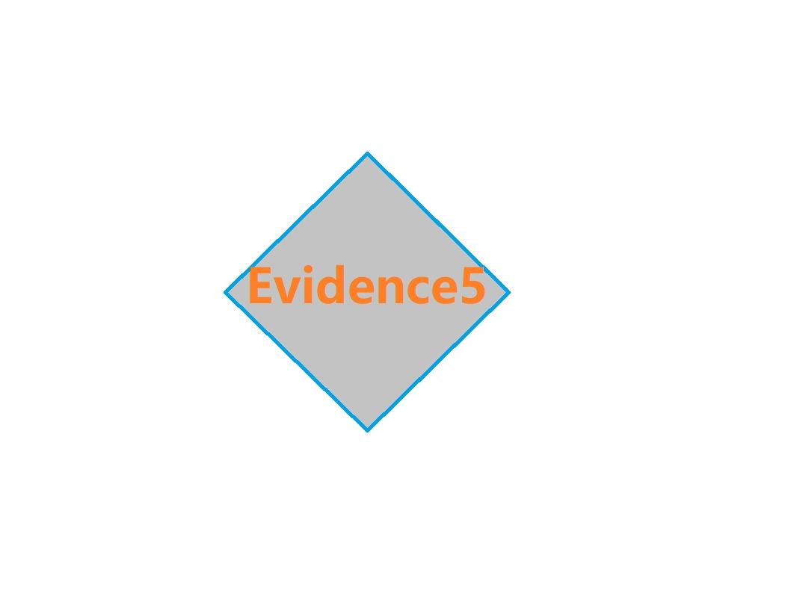

文件名：tmp

md5：da5d01d2f7e8c37ab1c1857be587ad74

六号文件藏在了cve.xlsx中，前面筛查的时候之检查了压缩包解开的第一层文件，并没有深入检查，这又告诉我们，文件检查的时候需要仔细。。。。以及有关网络安全词汇的文件要重点检查。

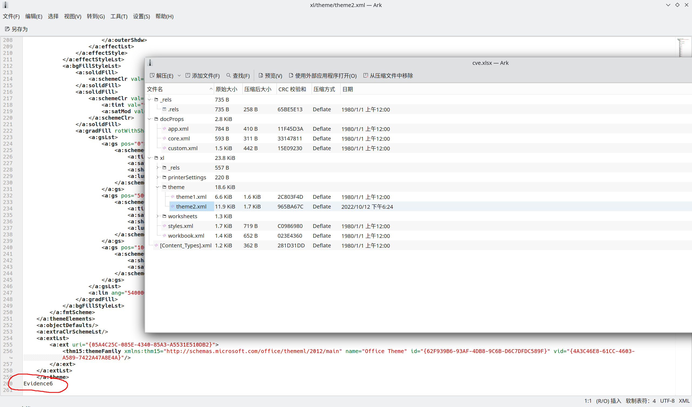

文件名：cve.xlsx

md5：c2b9d953d7e04c8e0d08fee3bd4513cd

8

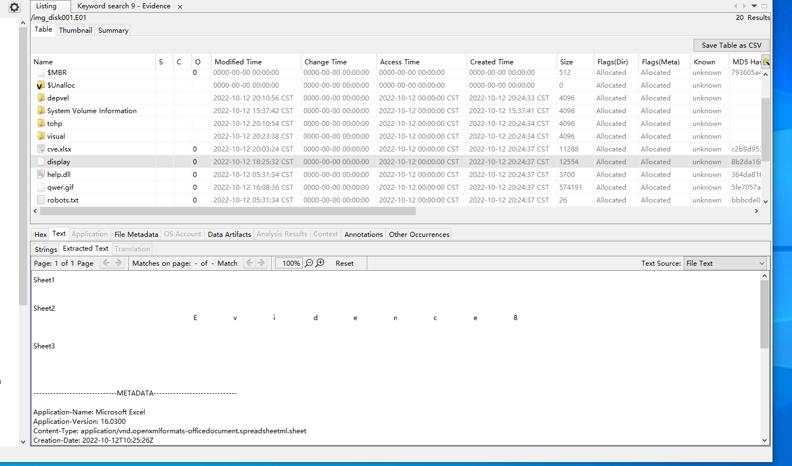

我  是  眼  瞎

文件名：display

md5：8b2da168f3221d343c4e3f1aceed3e88

第九题

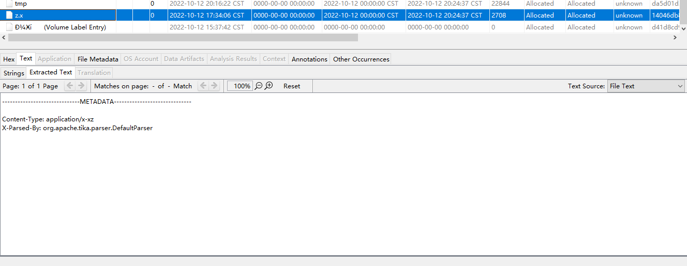

是一个xz压缩，其实人家都告诉你了，但是孤陋寡闻没接触过这种压缩格式

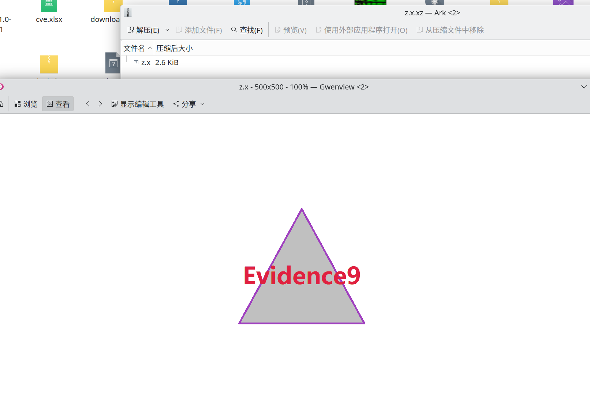

文件名：z.x

md5：14046db8621b2aca9ffced76d23cc6e9

第四题

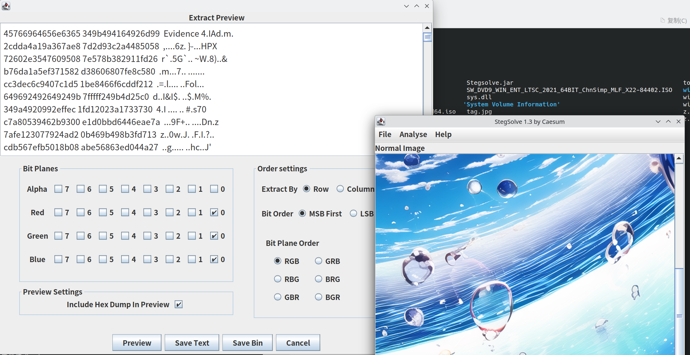

需要用到他提供的图片隐写的查看工具

以前从来没接触过，到时候在图片隐写那一章在研究下

文件名：sea.png

md5：1c990420fc307c7bd2b65396c5e5e13f

第二题

根据解析，是一个简单的后缀修改，但是我并没有看到相关信息

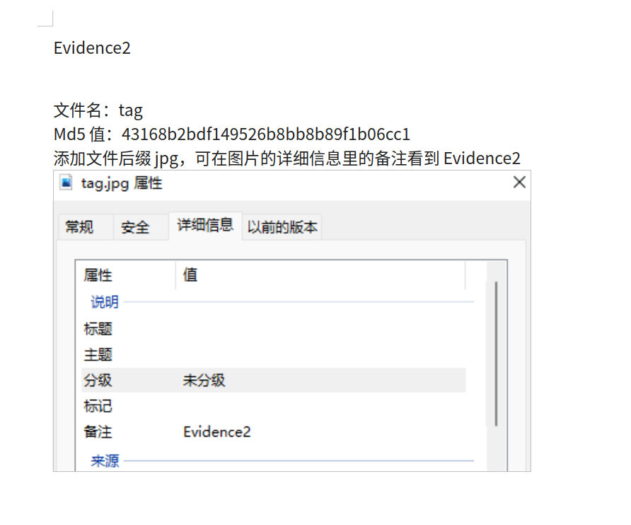

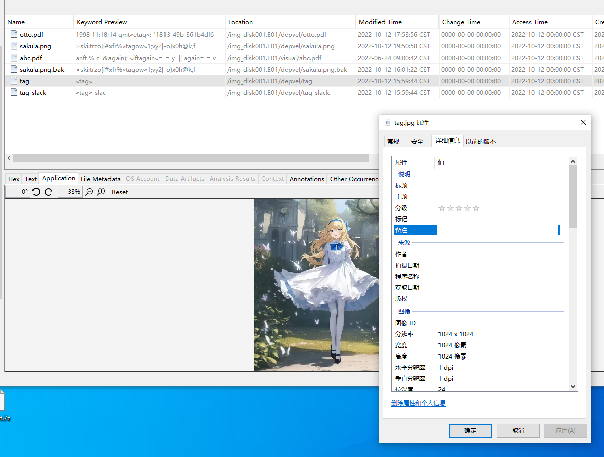
